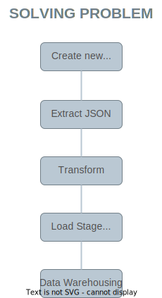
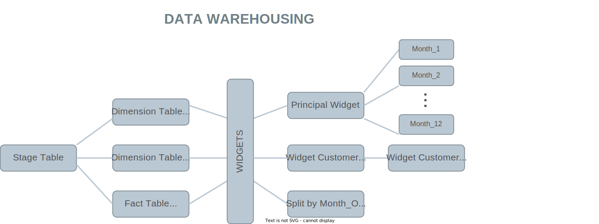
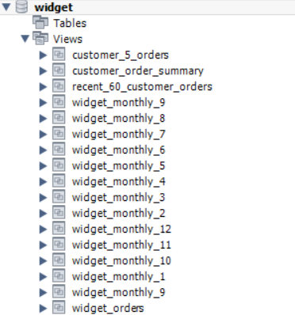
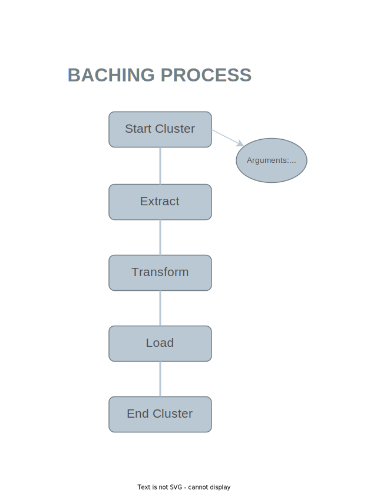
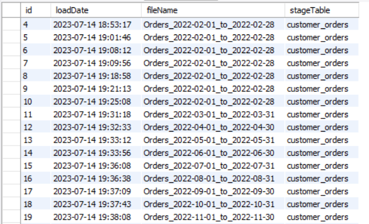
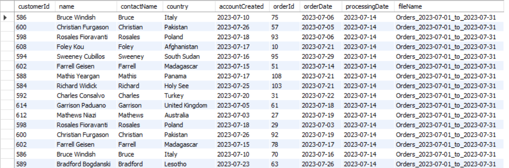
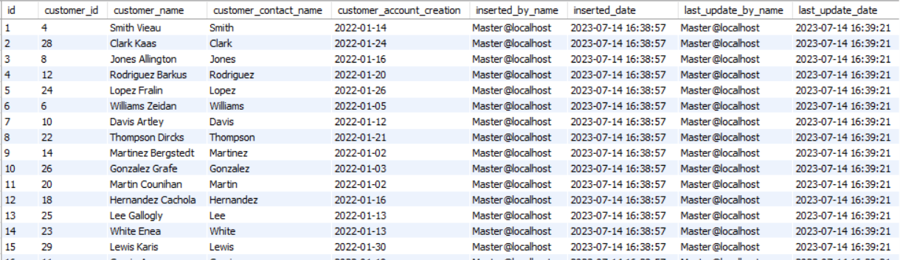
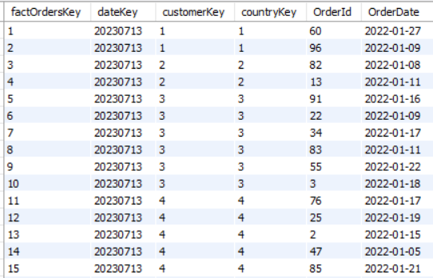
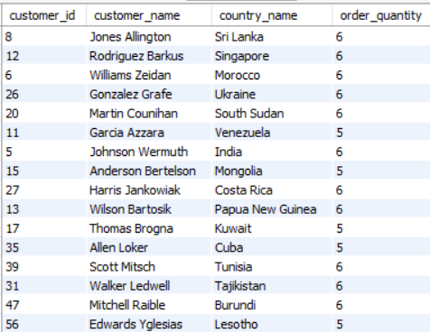

# Data Engineering Assessment - Innovus lab

Welcome to the most exciting and mind-blowing Data Engineering Assessment project by Miguel Tuberquia! 🚀

In this project, we aim to showcase our exceptional skills in data. I'll be tackling complex data challenges with the help of Python, MySQL, and Apache Spark. Brace yourselves for a thrilling adventure through the realms of data engineering!

## Project Highlights

- Extract mind-boggling data from various sources using our powerful DataExtractor class.
- Transform the data like a magician with our DataTransformer class, making it ready for further analysis.
- Load the transformed data into the database using the amazing DataLoader class.
- Execute mind-blowing SQL queries on the loaded data with our QueryExecutor class.
- Sit back and watch as the magic unfolds, delivering valuable insights and stunning visualizations.

## Prerequisites

To embark on this epic journey, make sure you have the following:

- Python 3.x installed on your machine
- MySQL database up and running
- Apache Spark configured (because we love to work with big data!)
- To make things easier, please check the `requirements.txt` file for the necessary dependencies.

## Getting Started

1. Clone this awesome repository to your local machine.
2. Install the required dependencies by running `pip install -r requirements.txt`.
3. Customize the project settings in `Settings/db_settings.py` to match your MySQL database configuration.
4. Prepare your data by placing the input JSON files in the `FilesToProcess` directory.
5. Modify the `main.py` file to tweak the project parameters and unleash your creativity.
6. Run the project by executing `python run_etl.py` and behold the magic!

## Running the ETL Process

To run the ETL process follow these steps:

1. Open a terminal or command prompt.
2. Navigate to the project directory.
3. Run the command `python run_etl.py` to execute the ETL process.

```bash
python run_etl.py --date <date> --input <input_path> --output <output_table>
```

4. Sit back and watch as the magic unfolds, transforming and loading the data into your MySQL database.
5. Marvel at the amazing results and insights generated by the ETL process.
6. Feel free to explore the generated views and tables in the database to dive deeper into the data.


## The Challenge Thoughts

### Problem Solving and Approach



In tackling this data engineering challenge, I followed a systematic approach to ensure the success and efficiency of the ETL process. Here's an overview of the key steps taken:

1. **Data Extraction**: I developed the `DataExtractor` class to extract data from the input JSON files. This class handles file handling and JSON parsing, ensuring that the data is extracted accurately.

2. **Data Transformation**: The extracted data is then transformed using the `DataTransformer` class. This class leverages the power of PySpark to perform complex transformations, such as exploding nested JSON arrays, flattening the data, and adding metadata columns.

3. **Data Loading**: The transformed data is loaded into the MySQL database using the `DataLoader` class. This class handles database connections, table creation, data loading, and error handling. It ensures that the data is loaded efficiently and reliably.

4. **Query Execution**: The `QueryExecutor` class executes a series of stored procedures in the MySQL database. These stored procedures handle tasks such as dimension table population, fact table creation, and view creation. The class ensures that the necessary SQL queries are executed accurately and in the correct order.

### Trade-offs and Decisions

During the development of this project, the following trade-offs and decisions were made:

1. **Use of Objects and Encapsulation**: Instead of creating a plain script, an object-oriented approach was chosen to encapsulate functionality into separate classes. This decision was made to improve code organization, modularity, and reusability. It allows for easier maintenance and extension of the codebase in the future.

2. **Logging and Monitoring**: To track the data load process and ensure data integrity, a log table was created to capture information about the ETL process, including execution logs, file names, and timestamps. This decision enables effective monitoring of the data loading process and provides a record of transactions for auditing purposes.

3. **Creation of Views**: Views were created based on the fact tables and dimension tables. These views provide a convenient and efficient way to access and analyze the data. By leveraging views, users can obtain aggregated and consolidated information without the need to perform complex queries directly on the underlying tables. This design choice makes the data model more robust and facilitates data analysis and reporting tasks.

4. **Modularization and Reusability**: The project was organized into separate modules and classes to promote code modularity and reusability. Each class has a specific responsibility, such as data extraction, transformation, loading, and query execution. This modular design allows for easier maintenance, testing, and future enhancements by isolating and focusing on specific functionality.

#### Project Structure
```css
project/
├── Utils/
│   ├── data_extractor.py
│   ├── data_transformer.py
│   ├── data_loader.py
│   ├── query_executor.py
├── Tests/
│   ├── test_data_extractor.py
│   ├── test_data_transformer.py
│   ├── test_data_loader.py
│   ├── test_query_executor.py
│   └── asserts/
│       └── TestData.json
├── Settings/
│   └── db_settings.py
├── main.py
├── run_etl.py
├── README.md
├── requirements.txt
```

5. **Error Handling and Exception Handling**: Error handling measures were implemented throughout the code to ensure proper handling of exceptions and error conditions. This includes handling file not found errors, JSON format errors, database connection errors, and other potential issues that may arise during the ETL process. Robust error handling improves the stability and reliability of the system.

6. **Database Indexing and Optimization**: The database schema was designed with appropriate indexing and optimization considerations. Primary keys and foreign keys were defined to establish relationships between tables, and indexes were created on frequently queried columns. This decision helps improve query performance and overall database efficiency.
This diagram showcases the star schema design used for the database, highlighting the dimension tables, fact table, and relationships between them.



7. **Monthly Split of the View**: The views in the widget schema were designed to include a monthly split of the data based on a specific convention. The convention takes into consideration the current date, such as 2023-07-14, to determine the time period for each view.


This monthly split allows for easy and efficient access to historical data by organizing it into separate views based on specific time periods. It facilitates data analysis and reporting tasks, enabling users to focus on a particular month or compare data between different months or years

These trade-offs and decisions were made to optimize the ETL process, enhance code maintainability, ensure data integrity, and provide a robust and efficient data model for analysis and reporting purposes.

### Error Handling Measures

To ensure the robustness of the ETL process, we implemented several error handling measures:

1. **File Not Found**: If the input JSON file is not found, an appropriate error message is raised, providing clear guidance to the user.

2. **JSON Parsing Error**: If the JSON file has an invalid format, a `ValueError` is raised, indicating the issue and prompting the user to check the file's integrity.

3. **Database Connection Error**: If there is an error establishing a connection to the MySQL database, an error message is displayed, indicating a potential network or configuration issue.

4. **Data Loading Error**: If an error occurs during the data loading process, such as table truncation or data insertion, an error message is logged, providing details about the specific error encountered.

5. **Query Execution Error**: If there is an error executing any of the stored procedures, an appropriate error message is logged, indicating the specific procedure and the error encountered.

### Visual Explnation

To provide a visual representation of the data flow and architecture, we have included the following diagrams:

1. **ETL Process Flow**: This diagram illustrates the step-by-step flow of the ETL process, starting from data extraction, through transformation and loading, to query execution and view creation.



2. **Database Schema**: Here are some screenshots of the populated tables in the MySQL database after running the ETL process:

* **Log Table**: This table captures information about the ETL process, including the execution logs, file names, and timestamps. 
* **Stage Table**: The stage table stores the raw data extracted from the input JSON files. It provides a temporary storage for further processing. 
* **Dimension Tables**: The dimension tables, such as `dim_customer` and `dim_countries`, store the unique records for customers and countries, respectively. They provide reference data for the fact table. 
* **Fact Table**: The fact table, `fact_orders`, contains the processed and transformed data, representing the orders with references to the customer and country dimensions. 
* **Widget Views**: The widget views, such as `vw_orders_summary` and `vw_customer_orders`, provide consolidated and aggregated information for easy access and analysis. 

These diagrams provide a high-level understanding of the project's structure and flow, aiding in comprehension and future enhancements.

I hope this narrative explanation gives you insight into the thought process, decision-making, and error handling measures taken throughout the development of this data engineering project. I hope that the provided solution and documentation serve as a solid foundation for your data engineering selection and make me a solid candidate. If you have any further questions or require additional assistance, please don't hesitate to reach out. The ball is in your court!!  🚀
